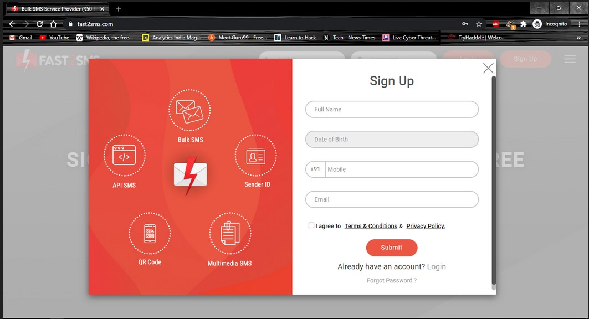
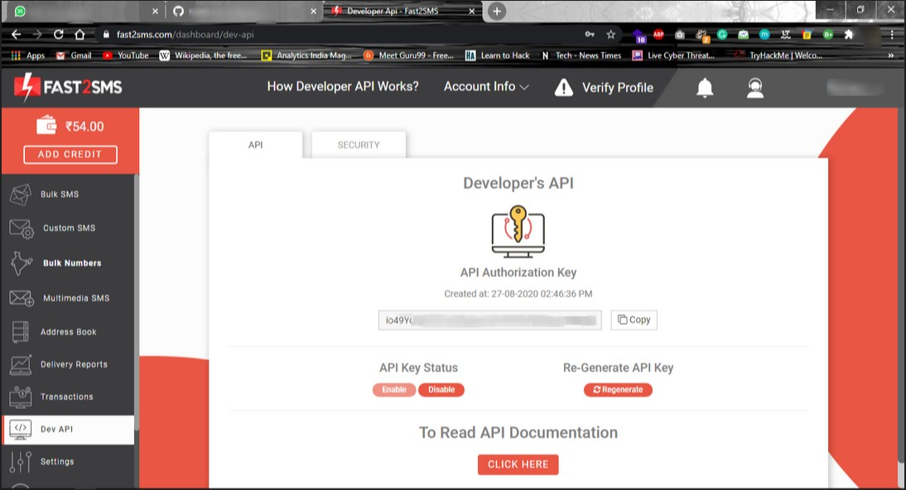
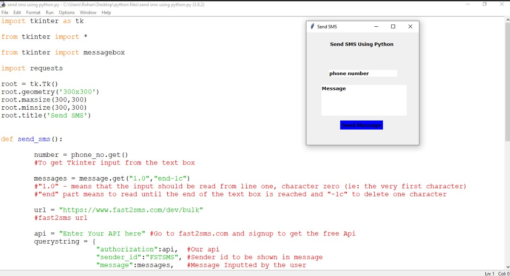

# Send SMS Using Python

Using this python program we can send message to a specified number using fast2sms API

##Procedure##
------------------------------------------------------------------------------------
1)Open [fast2sms](https://www.fast2sms.com/) Website And Signup Using Your Mobile Number

-------------------------------------------------------------------------------------
2)In Dashboard Go To DEV-API

-------------------------------------------------------------------------------------
3)Copy The API Key And Paste It In the Variable "api"

-------------------------------------------------------------------------------------
4)Run The Code And Send SMS By Inputting the Mobile Number And Message

-------------------------------------------------------------------------------------
5)RESULT

-------------------------------------------------------------------------------------